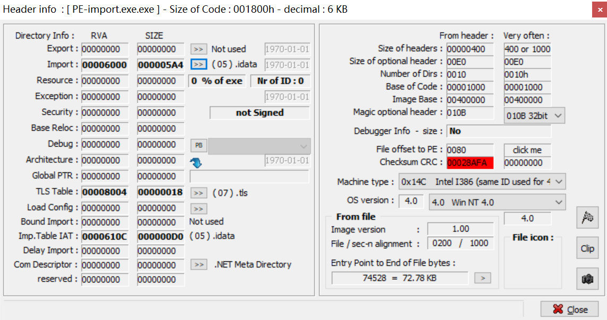
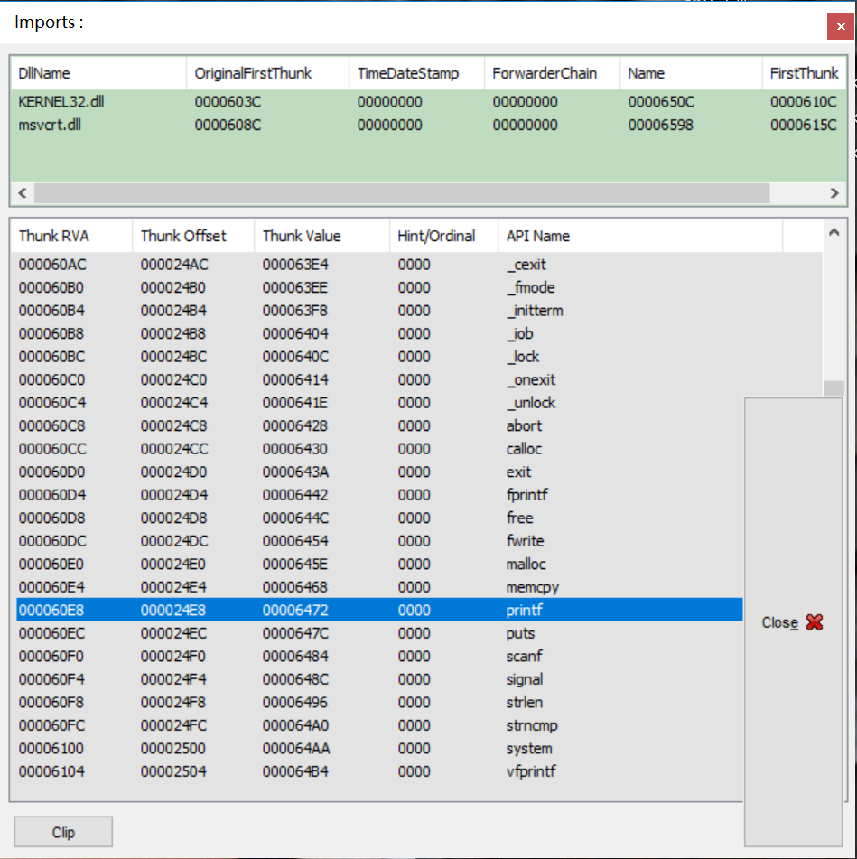
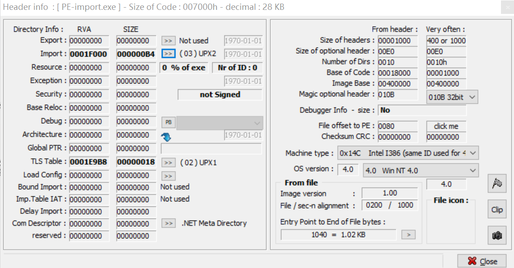
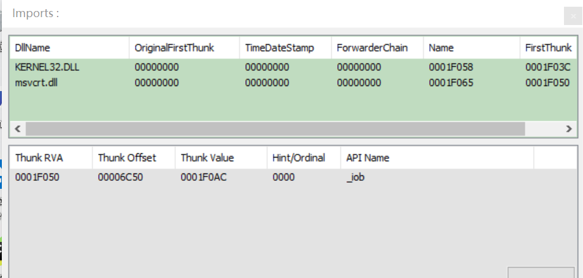
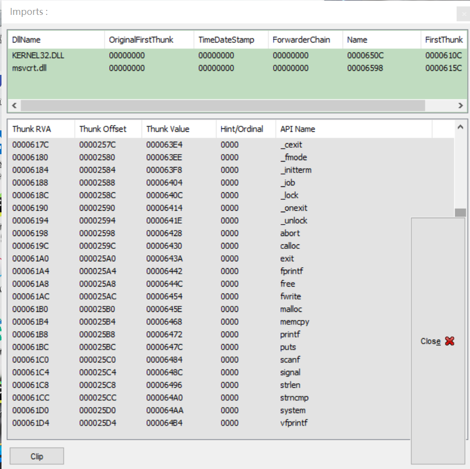
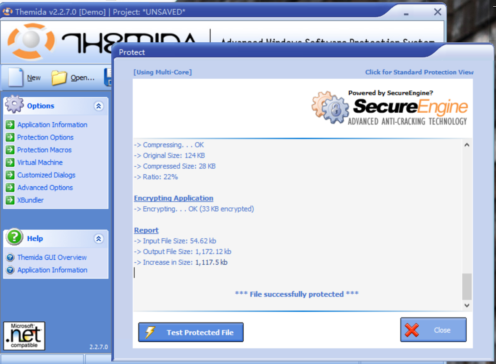
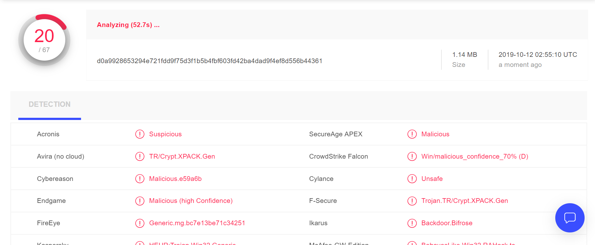

# Mimic malware

The project is to develop a type of malware which can halt the computer system and cause pop-up screen.  At the same time, we use Exeinfo PE and UPX tool to pack the program and to check the content of my program. At last, I use the encryption tool THemida to encrypt the program.  

    

## Files
Script.cpp --> program C++ script  
Script.o  --> object file of the program  
PE-Import.exe --> the portable execuitable file  
Result package --> reserve the results of import tables        

## Write virus scripts and check the program  

It's a simple transcript to halt user's computer system or cause continuous warn windows. At first, I create a file named Script.cpp and then I compile it into Script.o and PE-Import.exe. At the same time, I create a 'PE-1.txt' in the root directory. Then I use Exeinfo PE tool to check  the original PE-Import.exe program. The  header information and import tables of the exe program are as below:    
  
  

 
## Pack and unpack the PE-Import.exe  

Secondly, I use UPX to pack the PE-Import.exe. The content of import tables are as follow:       
command: upx D:\CProgrammingCoursework\ComSeqAss\PE-import.exe  
  
  

After that, I unpack the PE-Import.exe and check the content of import tables:  
command: upx -d D:\CProgrammingCoursework\ComSeqAss\PE-import.exe  
  
  

## Encrypt and detect the program  

Finally, I use the encryption tool **THemida** to encrypt the PE-import.exe and then use the virustotal tool to detect the encrypted program. Here is the result of detection:  

